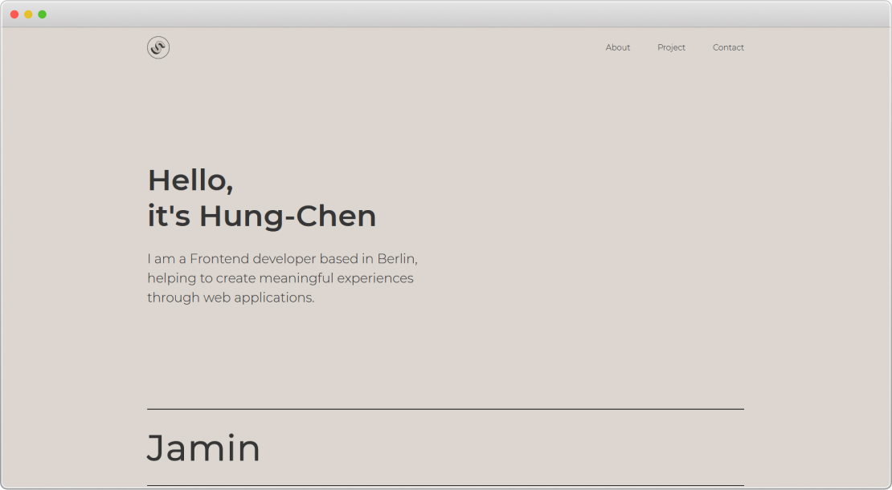
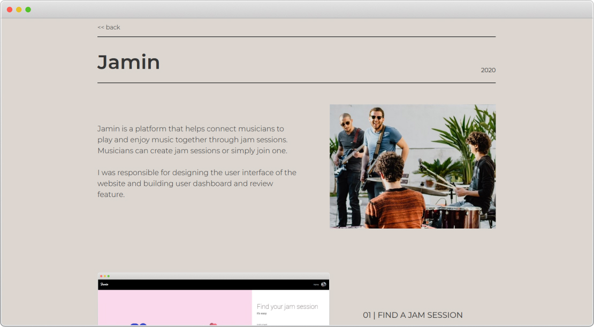

# 

My personal website created with React.
 
 
 

## Screenshot

 
Homepage
 
 
 

 
Project page
 
 

## Notes and learning

This is a rebuilt of my website.
The UI design is very similar to the previous version but with a different tech stack. (React, Typescript, styled-components)

The intention is to

- make the components as reusable as possible
- try out CSS in JS, which I used styled-components in this project
- learn typescript

 

Below are some of my notes and learnings:

on CSS in JS

- Writing styles in a component helps encapsulated everything in one document. 
  This brings benefits including ease of adding or removing a component, reduce unused CSS code in the code base, and prevent unexpected styling on other elements)
- To reduce the complexity when component files grow, we could separate styled-component from the actual component (and put them in the same folder)
- It is helpful to add a prefix to styled components. This helps to differentiate styled components from actual components easily. One of the possible ways to implement this is by importing styled components as object with the "Styled" prefix.
